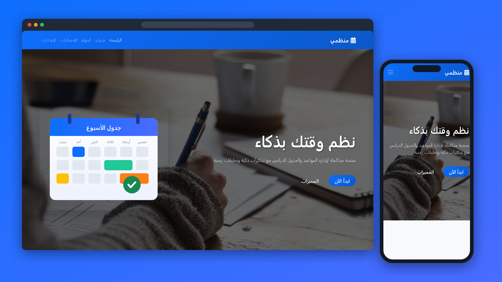

<div align="center">

# 📅 Munazzami · منظمي

**A study and appointment planner: calendar, tasks and progress charts, all in the browser.**

[](https://mo1amin.github.io/study-planner/)




</div>

## ✨ Features

- **Schedule:** a month calendar; add appointments and see what is on each day
- **Tasks:** add tasks with a priority, filter them, mark them done or delete them
- **Statistics:** study hours per day (bar chart) and a doughnut chart of your tasks, built with Chart.js
- **Settings:** dark mode, theme colour and reminder time, saved in `localStorage`
- **Polish:** Arabic right-to-left layout, SweetAlert2 dialogs and scroll animations (AOS)

## 🧰 Built with

HTML · CSS · JavaScript · Bootstrap 5 (RTL) · Chart.js · Moment.js · SweetAlert2 · AOS · Font Awesome

## ▶️ Run it

No build step. Open `index.html` in a browser, or serve the folder:

```bash
npx serve .
```

---

<div align="center">Made by <a href="https://github.com/Mo1Amin">Mohamed Amin</a></div>
